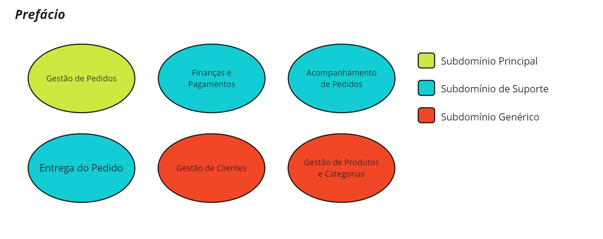
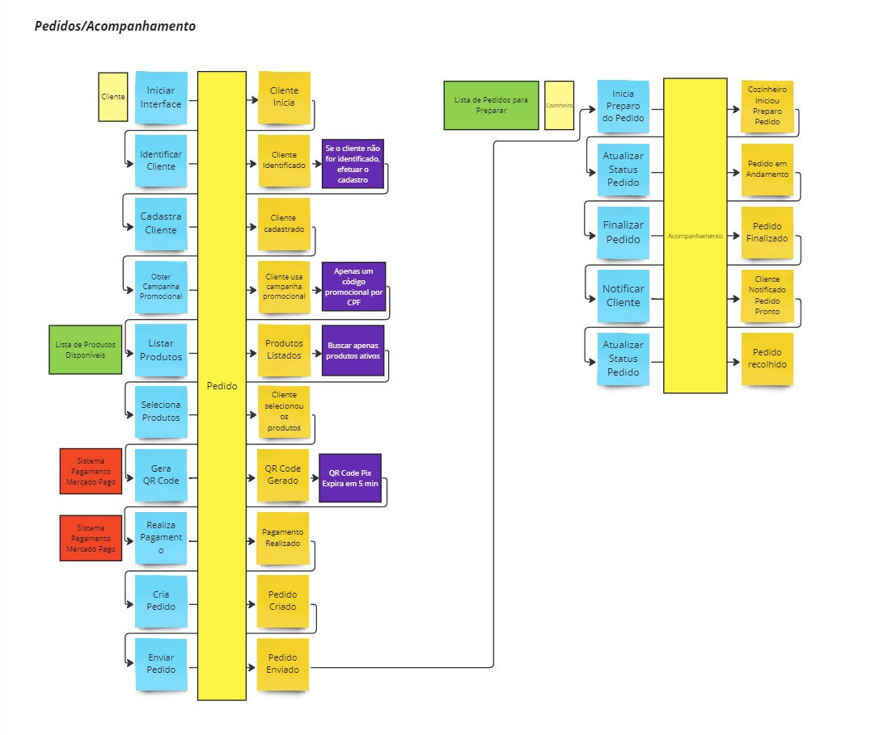
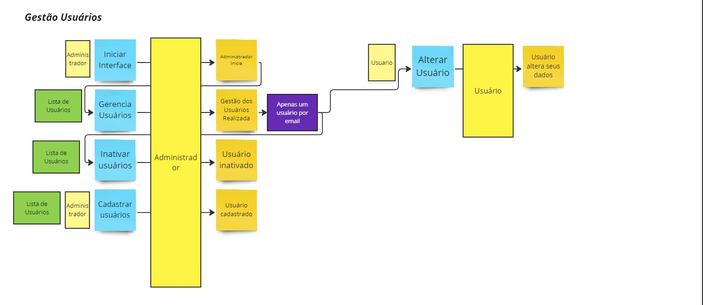
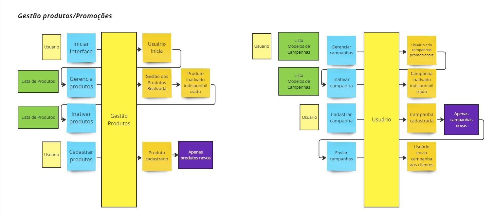
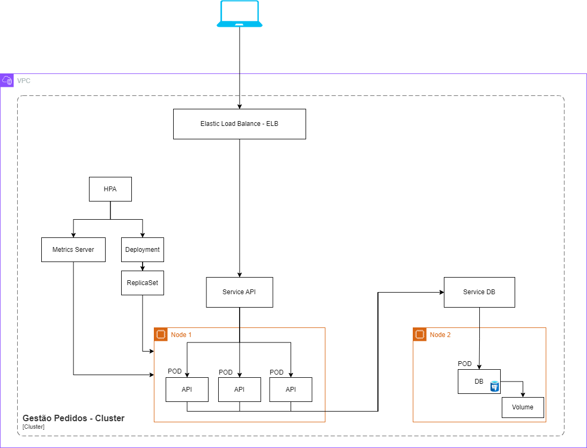
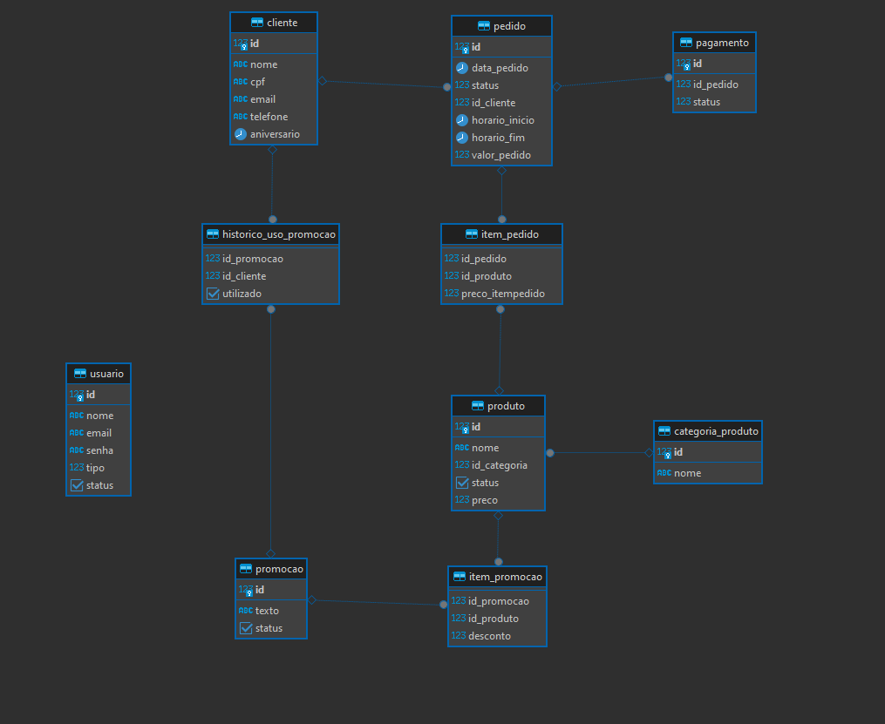

# GestaoPedidos

## História Inicial

Há uma lanchonete de bairro que está expandindo devido seu grande sucesso. Porém, com a expansão e sem um sistema de controle de pedidos, o atendimento aos clientes pode ser caótico e confuso. Por exemplo, imagine que um cliente faça um pedido complexo, como um hambúrguer personalizado com ingredientes específicos, acompanhado de batatas fritas e uma bebida. O atendente pode anotar o pedido em um papel e entregá-lo à cozinha, mas não há garantia de que o pedido será preparado corretamente. 

Sem um sistema de controle de pedidos, pode haver confusão entre os atendentes e a cozinha, resultando em atrasos na preparação e entrega dos pedidos. Os pedidos podem ser perdidos, mal interpretados ou esquecidos, levando à insatisfação dos clientes e a perda de negócios. 

Em resumo, um sistema de controle de pedidos é essencial para garantir que a lanchonete possa atender os clientes de maneira eficiente, gerenciando seus pedidos e estoques de forma adequada. Sem ele, expandir a lanchonete pode acabar não dando certo, resultando em clientes insatisfeitos e impactando os negócios de forma negativa. 

Para solucionar o problema, a lanchonete irá investir em um sistema de autoatendimento de fast food, que é composto por uma série de dispositivos e interfaces que permitem aos clientes selecionar e fazer pedidos sem precisar interagir com um atendente, com as seguintes funcionalidades:

## Funcionalidades

Pedido
     - Os clientes são apresentados a uma interface de seleção na qual podem optar por se identificarem via CPF, se cadastrarem com nome, e-mail ou não se identificar, podendo montar o combo na seguinte sequência, sendo todas elas opcionais: 
        Lanche 
        Acompanhamento 
        Bebida 
        Sobremesa
     Em cada etapa é exibido o nome, descrição e preço de cada produto.

Acompanhamento
    - Uma vez que o pedido é confirmado e pago, ele é enviado para a cozinha para ser preparado. Simultaneamente aparece em um monitor para o cliente acompanhar o progresso do seu pedido com as seguintes etapas: 
        Solicitado,
        EmPreparo,
        Pronto,
        Recebido,
        Finalizado

Entrega
    - Quando o pedido está pronto, o sistema deverá notificar o cliente que ele está pronto para retirada. Ao ser retirado, o pedido deve é atualizado para o status finalizado. Além das etapas do cliente, o estabelecimento detém de um acesso administrativo

Gerenciar clientes/Promoções
    - Com a identificação dos clientes o estabelecimento trabalhar em campanhas promocionais e utilizações das promoções

Gerenciar produtos e categorias 
    -Os produtos dispostos para escolha do cliente são gerenciados pelo estabelecimento, definindo nome, categoria, preço, descrição e imagens. 
    Categorias fixas 
        Lanche 
        Acompanhamento 
        Bebida 
        Sobremesa

Acompanhamento de pedidos 
    - Disponível acompanhar os pedidos em andamento e tempo de espera de cada pedido. As informações dispostas no sistema de pedidos podem ser gerenciadas pelo estabelecimento através de um painel administrativo.

Pagamento
    - O sistema possui uma opção de pagamento/checkout do pedido.

## Event Storming

## Infraestrutura/Desenho Técnico

Utilizamos o EKS como serviço para gerenciamento do Kubernets.
Para a API criamos o deployment com as definições da aplicação, o qual é encarregado de criar nossos replicaSet e este criar nossos pods com os containers internamente.
Além disso criamos um service loadbalance para distribuição de carga.
Complementando para autoscale usado o HPA juntamente com o metrics server para que seja possível metrificar e escalar a aplicação.

Para o banco de dados usamos postgresql e definimos o deployment do servidor de banco, bem como o seu service para acessar e o volume para os dados.

Abaixo temos a imagem ilustrativa;

## Database

Para a aplicação gestão de pedidos utilizamos um banco relacional PostgreSQL, para garatir a estrutura, integridade da relação entre as entidades principais, cliente, produto e pedido, além das tabelas complementares.

- Um cliente pode ter diversos pedidos, o qual este pedido pode ter diversos produtos. Desta forma temos a tabela cliente com o relacionamento 1xN com o pedido. 
- Pelo fato do pedido ter diversos produtos, a tabela pedido e produto tem um relacionamento NxM. Onde diversos produtos podem estar contidos em um pedido.
- Este produto detém uma categoria, e essa categoria pode estar alocada em diversos produtos, com isso, está estruturado que a categoria produto pode estar relacionado a diversos produtos.
- O cliente tem possilidade de usar promoções. E para comportar essa estratégia, uma promoção pode estar relacionada a diversos lientes e diversos clientes podem estar usando tal promoção. A tabela então fica definida com 1xN a tabela Cliente com a tabela UsoPromoções, e a tabela promoção 1xN com a tabela UsoPromoções.
- Relacionado a promoção podemos ter diversos produtos, estes por sua vez podem estar relacionado a diversas promoções. Para isso, a tabela Produto tem um relacionamento 1xN com ItensPromoção e 1xN entre a tabela Promoção e ItensPromoção.
Atrelado ao pedido temos a tabela de pagamento para sinalizar o status.
Para alocar o usuário foi criado a tabela Usuário contendo as informações básicas do mesmo.

